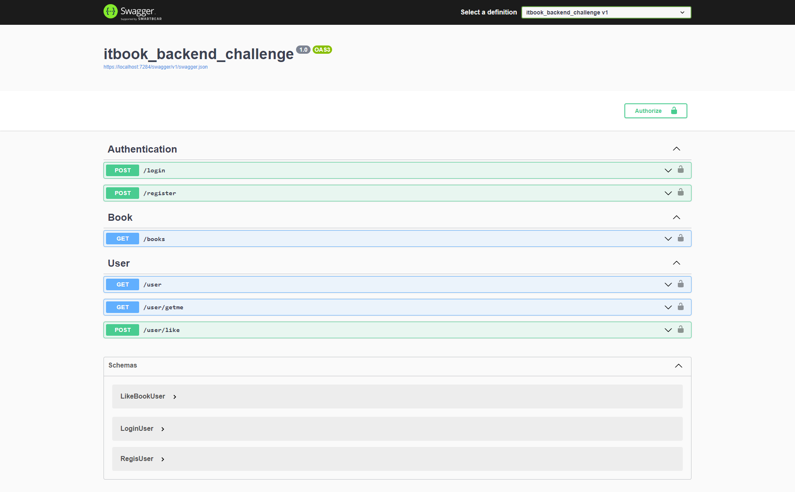

# itbook_backend_challenge

# เครื่องมือที่ใช้พัฒนาระบบ
  -  MySql
  - .NET 6 Core Web API

# package ที่ใช้ในระบบ 
  itbook_backend_challenge
    - [Microsoft.AspNetCore.Authentication.JwtBearer](https://www.nuget.org/packages/Microsoft.AspNetCore.Authentication.JwtBearer)
    - [MySql.EntityFrameworkCore](https://www.nuget.org/packages/MySql.EntityFrameworkCore)
  itbook_backend_challenge.Test
    - [Microsoft.AspNetCore.Mvc.Testing](https://www.nuget.org/packages/Microsoft.AspNetCore.Mvc.Testing)

# ขั้นตอนการรัน
  - [Download and install Visual Studio 2022](https://visualstudio.microsoft.com/vs/)
  - Configure Git to your Visual Studio
  - Clone a Git Repository [itbook_backend_challenge](https://github.com/TdotShare/itbook_backend_challenge)
  - Download File Database Itbook_test.sql import database(xampp phpmyadmin)
  - Config connection database to path [/Config/LibraryContext.cs](https://github.com/TdotShare/itbook_backend_challenge/blob/main/itbook_backend_challenge/Config/LibraryContext.cs)
  - Open Project And F5 Start Debugging
